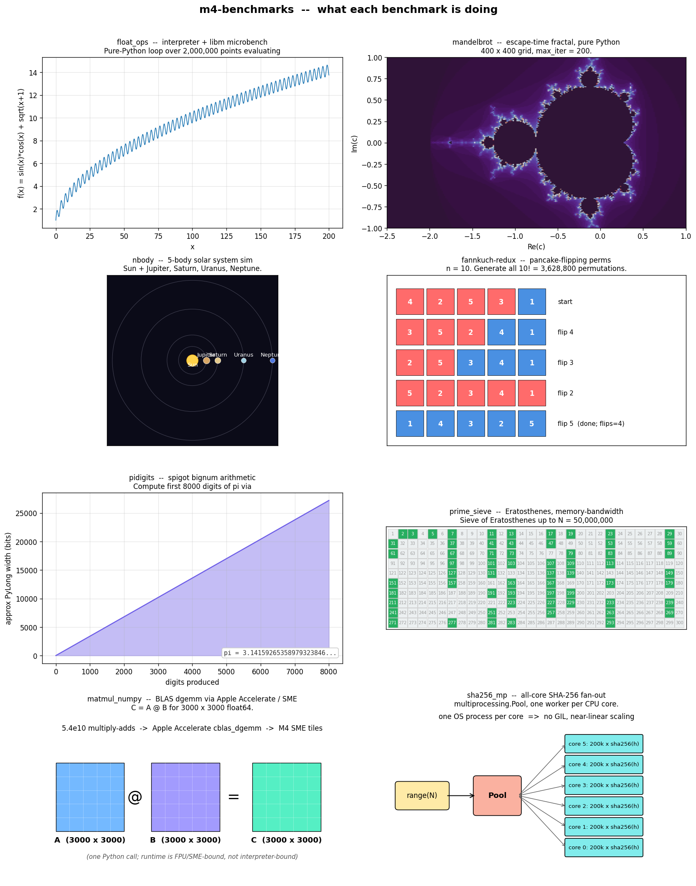
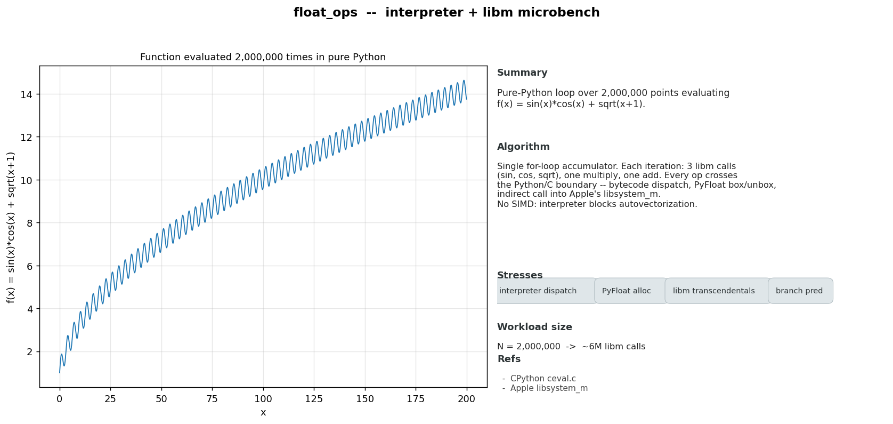
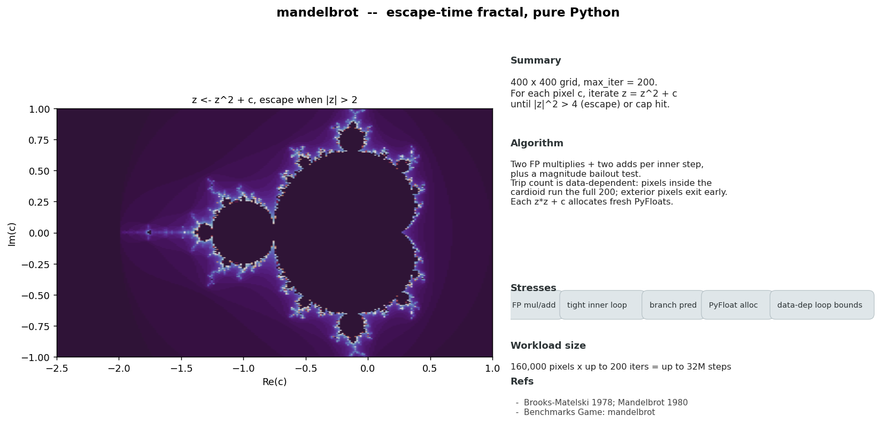
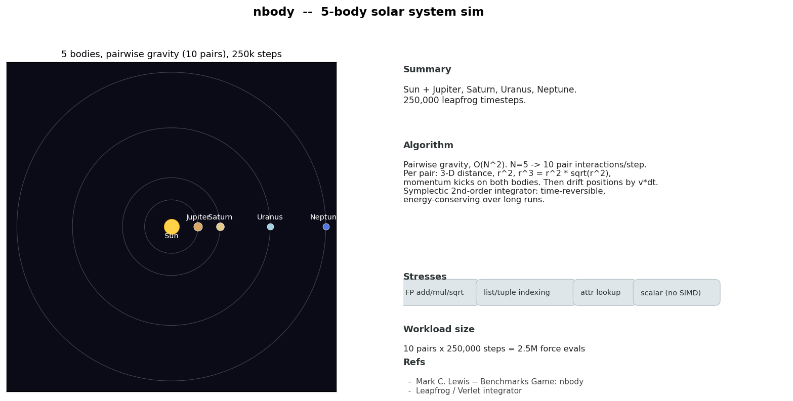
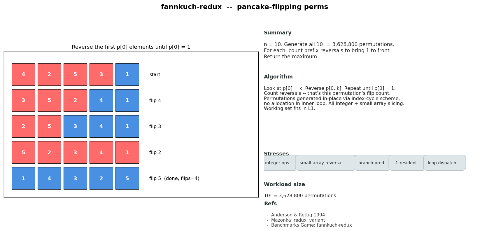
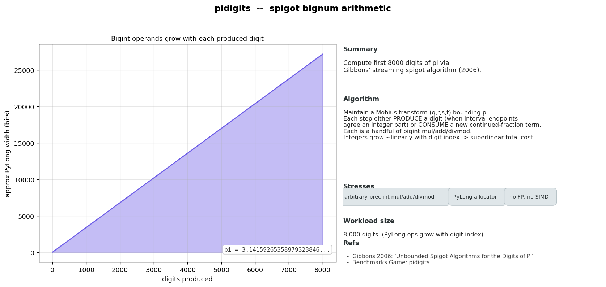
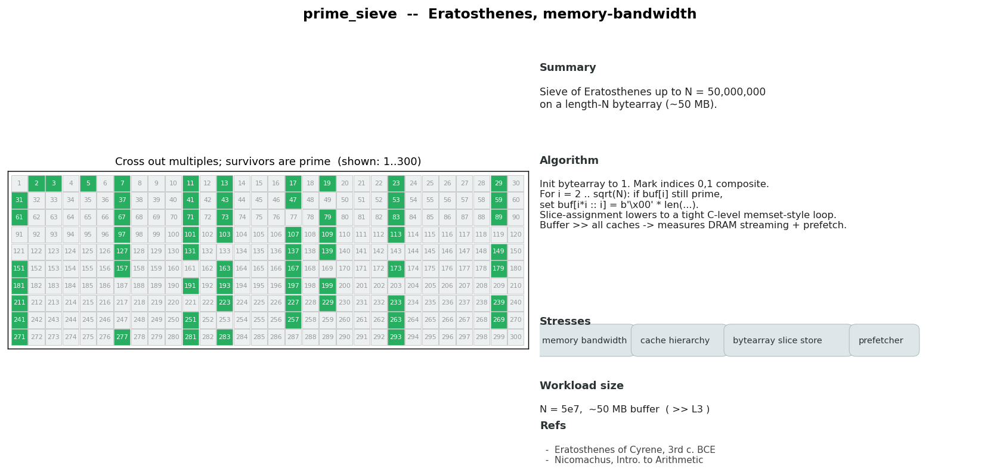
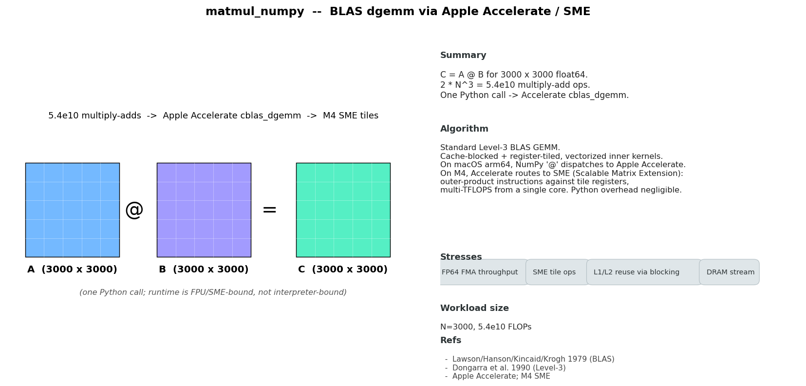
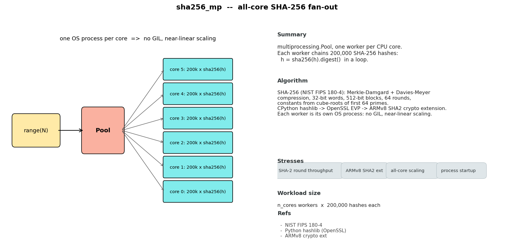

# m4-benchmarks

Python CPU benchmarks for Apple M4. Runs against Python 3.11, 3.12, 3.13, 3.14, and 3.14t (free-threaded / no-GIL) via `uv`.

## Setup

```bash
uv python install 3.11 3.12 3.13 3.14 3.14t
```

Dependencies required for the C benchmarks, using Brew
```bash
brew install gmp openssl@3
```

Create individual .venvs for each environment
```bash
uv venv .venv-3.11 --python 3.11
uv venv .venv-3.12 --python 3.12
uv venv .venv-3.13 --python 3.13
uv venv .venv-3.14 --python 3.14
uv venv .venv-3.14t --python 3.14t
```

`3.14t` = free-threaded build (PEP 703). GIL disabled by default; scripts export `PYTHON_GIL=0` only for `*t` versions to keep C extensions from re-enabling it.

## Run all benchmarks

```bash
./run_all.sh
```

Loops 5 Python versions × 8 benchmarks + 8 C benchmarks. Appends rows to `results/results.csv`. Auto-plots at end.

Pass `--fresh` to wipe `results/results.csv` first (default keeps history; plots take median across all runs):

```bash
./run_all.sh --fresh
```

If a prior shell exported `PYTHON_GIL=0` globally, non-`t` Pythons crash with `Disabling the GIL is not supported by this build`. Clear it before running:

```bash
unset PYTHON_GIL
./run_all.sh
```

## Plot only (no re-run)

```bash
UV_PROJECT_ENVIRONMENT=.venv-3.12 uv run --python 3.12 python plot.py
```

PNGs land in `results/plots/`:
- `<benchmark>.png` — bar chart, runtime per version
- `_heatmap.png` — all benchmarks × versions, relative speed

## Run single benchmark on single version

```bash
UV_PROJECT_ENVIRONMENT=.venv-3.12 uv run --python 3.12 python runner.py mandelbrot
```

`UV_PROJECT_ENVIRONMENT` keeps per-version venvs separate. Without it `uv` rebuilds `.venv` and trashes prior version's install.

Optional flags:
- `-n 10` — iterations (default 5)
- `--notes "thermal throttle test"` — free-text column in CSV

## Benchmarks

| Name | Stresses |
|------|----------|
| `float_ops` | Pure-Python float math (sin/cos/sqrt) |
| `mandelbrot` | Pure-Python escape-time loop, float-heavy |
| `nbody` | Pure-Python physics sim, list/float heavy |
| `fannkuch` | Pure-Python integer permutation |
| `pidigits` | Bignum arithmetic |
| `prime_sieve` | Bytearray + integer, memory bandwidth |
| `matmul_numpy` | NumPy gemm via Apple Accelerate / SME |
| `sha256_mp` | All-core multiprocess SHA-256 fan-out |

For per-benchmark deep dives — algorithm, what each one stresses, references, and rendered explainer diagrams — jump to **[Benchmark explanations](#benchmark-explanations)** at the bottom.

## Layout

```
python_benchmarks/  one file per Python benchmark, each exposes run()
c_benchmarks/       C port of every benchmark + Makefile
runner.py           times one benchmark (Python or C), appends CSV row
plot.py             CSV -> PNG plots
plot_explainer.py   per-benchmark explainer PNGs (algorithm + stresses + refs)
plot_pyperf.py      pyperf JSON -> PNG plots
run_all.sh          loop versions x benchmarks (Python + C)
run_pyperf.sh       loop versions x pyperformance + plot
results/            results.csv, pyperf-*.json, plots/
```

## Add a benchmark

Drop `python_benchmarks/foo.py` with a `run()` function. Add `foo` to `BENCHES` in `run_all.sh`. For a C variant, drop `c_benchmarks/foo.c` defining `void run(void)` and add a build rule in `c_benchmarks/Makefile`.

## C benchmarks

C ports of every Python benchmark, treated as another "version" in the CSV (`python_version` = `C-clang<major>`, `python_impl` = `C`). Same workload sizes as Python. Compiled with `-O3 -mcpu=apple-m4`.

Backends chosen for fair compare:
- `pidigits` — GMP (`libgmp`) for arbitrary-precision int (matches Python int internals).
- `matmul_numpy` — `cblas_dgemm` via Apple Accelerate (same backend numpy uses on macOS).
- `sha256_mp` — OpenSSL EVP (same impl as Python `hashlib`), pthreads for fan-out.

System deps (Homebrew):

```bash
brew install gmp openssl@3
```

Build:

```bash
make -C c_benchmarks
```

Run all C benches (called automatically by `run_all.sh`):

```bash
for b in float_ops mandelbrot nbody fannkuch pidigits prime_sieve matmul_numpy sha256_mp; do
    uv run --python 3.12 python runner.py --lang c "$b"
done
```

Single C bench:

```bash
uv run --python 3.12 python runner.py --lang c mandelbrot
```

## Pyperformance (full official suite)

Run + plot:

```bash
./run_pyperf.sh
```

Slow — pyperformance runs ~60 benchmarks per version. Outputs:
- `results/pyperf-3.11.json`, `pyperf-3.12.json`, `pyperf-3.13.json`, `pyperf-3.14.json`, `pyperf-3.14t.json`
- `results/plots/pyperf/<benchmark>.png` + `_heatmap.png`
- text comparison printed at end

Some pyperformance benches may skip on `3.14t` if a C extension lacks a free-threaded wheel.

Plot only (after JSONs exist):

```bash
UV_PROJECT_ENVIRONMENT=.venv-3.12 uv run --python 3.12 python plot_pyperf.py
```

Single version manual:

```bash
uvx --python 3.12 --from pyperformance pyperformance run -o results/pyperf-3.12.json
```

Text-only comparison (no plot):

```bash
uvx --from pyperformance pyperformance compare \
    results/pyperf-3.11.json results/pyperf-3.13.json
```

## Reset results

```bash
rm results/results.csv results/pyperf-*.json
rm -rf results/plots
```

CSV is append-only — re-runs add new rows, plots use median across rows per (benchmark, version).

---

## Benchmark explanations

Each benchmark targets a different layer of the Python + hardware stack — interpreter
dispatch, scalar FPU, branch predictor, memory bandwidth, SME tiles, all-core
parallelism. Below: what each one is computing, how the algorithm works, what
component of the machine it actually exercises, and where it comes from.

The plots embedded here are generated by [`plot_explainer.py`](plot_explainer.py).
Regenerate with:

```bash
UV_PROJECT_ENVIRONMENT=.venv-3.12 uv run --python 3.12 python plot_explainer.py
```

### Overview

All 8 benchmarks at a glance:



---

### `float_ops` — interpreter + libm microbench



**What it computes.** A pure-Python `for` loop over 2,000,000 points evaluates
`f(x) = sin(x)·cos(x) + √(x+1)` and accumulates the result.

**Algorithm.** One bytecode loop. Each iteration performs three libm calls
(`math.sin`, `math.cos`, `math.sqrt`), one float multiply, and one add.
Every operation crosses the Python/C boundary: `FOR_ITER`, `LOAD_GLOBAL`,
`CALL`, `BINARY_OP` bytecodes; `PyFloat` box and unbox on every result;
indirect call into the platform libm (Apple's `libsystem_m` on macOS).

**What it stresses.** Interpreter dispatch overhead, `PyFloat` allocator
churn, libm transcendental throughput, branch prediction in the eval loop.
The FPU is never the bottleneck here — autovectorization can't see through
the interpreter, so the bench measures per-bytecode dispatch cost (tens of
ns/op). A JIT (PyPy) or AOT compiler (the C port) collapses the same loop
to a few vector instructions and runs orders of magnitude faster — which
is the entire point of pitting CPython versions against each other on this
workload.

**Workload size.** N = 2,000,000 → ~6M libm calls, ~10M float ops total.

**Refs.** CPython interpreter loop in
[`Python/ceval.c`](https://github.com/python/cpython/blob/main/InternalDocs/interpreter.md);
dispatch overhead background in
[Barany 2014](https://www.cristal.univ-lille.fr/dyla14/papers/dyla14-8-Python_Interpreter_Performance_Deconstructed.pdf).

---

### `mandelbrot` — escape-time fractal, pure Python



**What it computes.** Membership in the Mandelbrot set on a 400×400 grid
covering roughly `[-2.5, 1.0] × [-1.0, 1.0]` of the complex plane,
`max_iter = 200`.

**Algorithm.** For each pixel `c`, iterate `zₙ₊₁ = zₙ² + c` from `z₀ = 0`
until either `|z|² > 4` (point has escaped) or the iteration cap is hit.
The escape-iteration count classifies the pixel. Each inner step is two
FP multiplies (`x²`, `y²`), two FP adds (combine into the new `x`, `y`),
and a magnitude bailout test. The trip count is data-dependent: pixels
inside the cardioid run the full 200 iterations; exterior pixels exit
early — so this is a stress test for the branch predictor and for
data-dependent loop bounds. In CPython every `z*z + c` allocates new
`PyFloat`s, so the bench measures interpreter + allocator throughput
much more than raw FPU throughput.

**What it stresses.** FP multiply/add, tight inner loop dispatch, branch
prediction on the bailout test, `PyFloat`/`PyComplex` allocation,
data-dependent loop trip counts.

**Workload size.** 160,000 pixels × up to 200 iters = up to ~32M inner steps.

**Refs.** Set first plotted by Brooks–Matelski (1978), visualized by
Mandelbrot at IBM (1980), popularized by Douady–Hubbard (1985) — see
[Mandelbrot set (Wikipedia)](https://en.wikipedia.org/wiki/Mandelbrot_set).
Benchmarks Game task spec:
[`mandelbrot`](https://benchmarksgame-team.pages.debian.net/benchmarksgame/description/mandelbrot.html).

---

### `nbody` — 5-body solar-system simulation



**What it computes.** Position evolution of the Sun + Jupiter, Saturn,
Uranus, Neptune over 250,000 timesteps under Newtonian gravity, using
a leapfrog/Verlet-family integrator. Initial conditions and simulation
constants come from the Benchmarks Game `nbody` task.

**Algorithm.** Each step computes pairwise gravitational accelerations
in `O(N²)` — for 5 bodies that's 10 pair interactions per step. Per pair:
3-D distance vector, `r²`, `r³ = r² · √(r²)`, then equal-and-opposite
momentum kicks on both bodies. Positions are then drifted by `v·dt`. The
integrator is symplectic and second-order: time-reversible, conserving
a "shadow" Hamiltonian so total energy doesn't drift over long runs —
this is the standard tool for orbital mechanics.

**What it stresses.** Scalar FP add/mul/sqrt throughput, list/tuple
indexing, attribute lookup. With N=5 the workload is far too small to
vectorize — per-step cost is dominated by Python interpreter overhead
on tiny scalar arithmetic, which makes the bench a clean way to compare
CPython's eval-loop performance across versions.

**Workload size.** 10 pairs × 250,000 steps = 2.5M force evaluations,
plus drift updates.

**Refs.** Benchmarks Game task by Mark C. Lewis:
[`nbody`](https://benchmarksgame-team.pages.debian.net/benchmarksgame/description/nbody.html).
Integrator background:
[Leapfrog integration (Wikipedia)](https://en.wikipedia.org/wiki/Leapfrog_integration).

---

### `fannkuch` — Fannkuch-redux pancake-flipping permutations



**What it computes.** For every permutation `p` of `[1..n]` with `n=10`,
look at `p[0] = k`, reverse the first `k` elements (one "pancake flip"),
and repeat until `p[0] = 1`. Count flips per permutation. The bench
returns the maximum flip count across all `10! = 3,628,800` permutations.

**Algorithm.** Permutations are enumerated in-place via an index-cycle
scheme (essentially a non-recursive Heap's-algorithm-style walk), so the
inner work is small-array index manipulation, integer comparison, and
prefix-reversal — no FP, no allocation in the inner loop. The "redux"
variant standardized a signed checksum (alternating sign by permutation
index) and the parallelization rules used by the Benchmarks Game.

**What it stresses.** Integer ops, small-array reversal, branch prediction,
loop dispatch. The working set fits entirely in L1, so this is a pure CPU
front-end + integer ALU benchmark.

**Workload size.** 10! = 3,628,800 permutations evaluated.

**Refs.** Defined in Anderson & Rettig (1994), "Performing Lisp Analysis
of the FANNKUCH Benchmark." Redux variant by Oleg Mazonka. Benchmarks
Game task:
[`fannkuch-redux`](https://benchmarksgame-team.pages.debian.net/benchmarksgame/description/fannkuchredux.html).

---

### `pidigits` — spigot bignum arithmetic



**What it computes.** First 8,000 decimal digits of π via Jeremy Gibbons'
streaming spigot algorithm (2006).

**Algorithm.** Maintain a Möbius transformation `(q, r, s, t)` that
represents the interval currently bounding π. At each step, either:
- **PRODUCE** a digit, when the integer parts at the two interval
  endpoints agree — emit the digit, contract the interval; or
- **CONSUME** a new term of π's continued-fraction expansion — refine
  the interval.

Each step is a handful of big-integer multiplies, adds, and floor-divides.
The integers grow roughly linearly with the digit index, so total cost
is super-linear in N. The benchmark therefore directly stresses CPython's
`PyLong` (base 2³⁰ schoolbook → Karatsuba → eventually FFT-based mul as
operands grow), or in GMP-backed languages, GMP's `mpn` layer.

**What it stresses.** Arbitrary-precision integer multiply/add/divmod,
`PyLong` allocator pressure as operands grow. No FP, no SIMD.

**Workload size.** 8,000 digits — `PyLong` operand width grows to roughly
27,000 bits by the end.

**Refs.** Jeremy Gibbons,
[*Unbounded Spigot Algorithms for the Digits of Pi* (2006)](https://www.cs.ox.ac.uk/jeremy.gibbons/publications/spigot.pdf).
Benchmarks Game task:
[`pidigits`](https://benchmarksgame-team.pages.debian.net/benchmarksgame/description/pidigits.html).
CPython `PyLong` internals:
[Python integer implementation](https://rushter.com/blog/python-integer-implementation/).

---

### `prime_sieve` — Sieve of Eratosthenes, memory-bandwidth bound



**What it computes.** Count of primes up to `N = 50,000,000` using a
Sieve of Eratosthenes on a length-N `bytearray` (≈50 MB).

**Algorithm.** Initialize the buffer to 1, mark indices 0 and 1 composite,
then for each `i = 2 .. √N`: if `buf[i]` is still prime, mark
`buf[i*i :: i] = b'\x00' * len(...)` — clearing all multiples of `i`.
The Python idiom for that mark-out is a slice assignment, which CPython
lowers to a tight C-level memset-style loop. So at `N = 5×10⁷` the bench
measures how fast the runtime can stream zeros through DRAM and the cache
hierarchy, not how fast Python iterates.

**What it stresses.** Memory bandwidth, cache hierarchy (50 MB buffer
is well past M4's L2/L3), bytearray slice store, hardware prefetcher.
Secondary integer-arithmetic cost in the outer loop is small.

**Workload size.** ~50 MB buffer, ~3M crossing-out operations across
all primes up to √N.

**Refs.** Algorithm attributed to Eratosthenes of Cyrene (3rd c. BCE)
via Nicomachus's *Introduction to Arithmetic*. See
[Sieve of Eratosthenes (Wikipedia)](https://en.wikipedia.org/wiki/Sieve_of_Eratosthenes).

---

### `matmul_numpy` — BLAS dgemm via Apple Accelerate / SME



**What it computes.** `C = A @ B` for two pre-generated 3000×3000 float64
matrices — about `2·N³ = 5.4×10¹⁰` multiply-add operations, dispatched
through one Python call into a BLAS implementation.

**Algorithm.** Standard Level-3 BLAS GEMM (`C = α·A·B + β·C`, here with
α=1, β=0). Production BLAS implementations are cache-blocked and
register-tiled with hand-tuned vectorized inner kernels. NumPy's `@`
operator dispatches to whichever BLAS NumPy was built against — on
macOS arm64 that's Apple's Accelerate framework, whose modern
`cblas_dgemm` ships hand-tuned kernels. On the M4, Accelerate dispatches
to **SME** (Scalable Matrix Extension), the first shipping Arm Scalable
Matrix Extension implementation. SME issues outer-product instructions
against a tile register file, hitting multi-TFLOPS throughput from a
single core.

**What it stresses.** FP64 FMA throughput, SME tile ops, L1/L2 reuse
through cache blocking, DRAM streaming of `A` and `B`. Python overhead
is essentially zero — the entire run is one C function call.

**Workload size.** N=3000, ~5.4×10¹⁰ FLOPs. Inputs (A and B) are
pre-allocated at import time so the bench only times the GEMM call,
not the RNG.

**Refs.** BLAS originally defined in
[Lawson, Hanson, Kincaid, Krogh (1979)](https://history.siam.org/sup/Lawson_BLAS.pdf);
Level-3 (`dgemm`) added by Dongarra, Du Croz, Duff, Hammarling (1990).
[Apple Accelerate](https://developer.apple.com/accelerate/).
M4 SME exploration:
[`tzakharko/m4-sme-exploration`](https://github.com/tzakharko/m4-sme-exploration).

---

### `sha256_mp` — all-core SHA-256 fan-out



**What it computes.** A `multiprocessing.Pool` with one worker per CPU
core. Each worker repeatedly chains `h = sha256(h).digest()` 200,000
times, starting from a per-worker seed.

**Algorithm.** SHA-256 (NIST FIPS 180-4) is a Merkle–Damgård hash built
from a Davies–Meyer compression function over 32-bit words. It processes
512-bit blocks in 64 rounds with constants derived from the cube roots
of the first 64 primes; each round mixes 8 working variables via
shift / rotate / xor / add. CPython's `hashlib.sha256` calls into
OpenSSL's EVP API — so the inner work is straight C/assembly, often
using SHA-NI on x86 or the **ARMv8 SHA2 crypto extension** on Apple
silicon. Because each Python worker is its own OS process, every core
has its own GIL, and scaling is near-linear with core count. (Threads
won't work here: the per-call payload is short, so `hashlib` doesn't
release the GIL.)

**What it stresses.** SHA-2 round throughput (rotate/xor/add), ARMv8
SHA2 crypto extension, all-core scaling, IPC-free embarrassing
parallelism, process startup overhead.

**Workload size.** `n_cores` workers × 200,000 chained hashes per worker.

**Refs.** [NIST FIPS 180-4 Secure Hash Standard](https://nvlpubs.nist.gov/nistpubs/fips/nist.fips.180-4.pdf).
[SHA-2 (Wikipedia)](https://en.wikipedia.org/wiki/SHA-2).
[Python `hashlib` docs](https://docs.python.org/3/library/hashlib.html)
(note: GIL released for inputs >2047 bytes; per-call hashes here are
short, so threading would not parallelize — multiprocessing is required).
